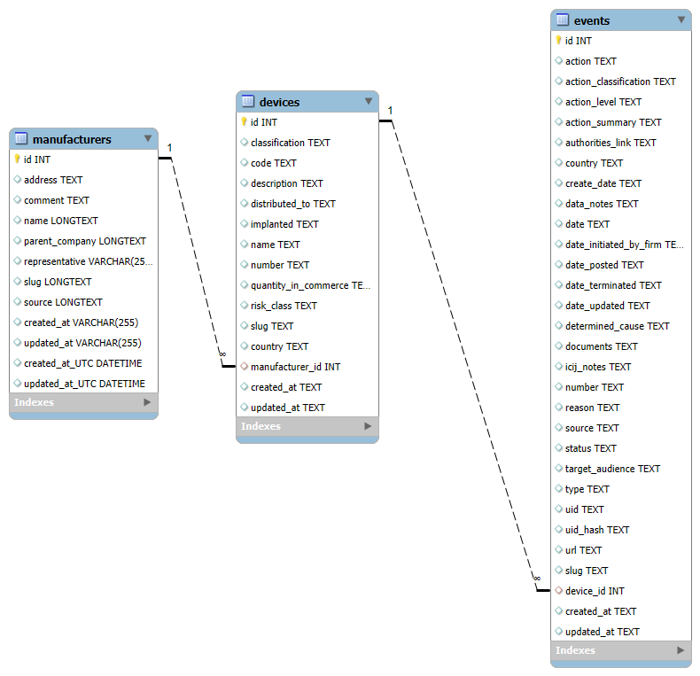

# 🏥 Medical Device Recall Analysis using SQL (ICIJ IMDD)

This SQL portfolio project analyzes global medical device recall data from the **International Consortium of Investigative Journalists (ICIJ)**. It involves importing real-world CSV data into MySQL, performing data cleaning and normalization, and using structured queries to reveal trends in recalls by manufacturers.

---

## 📊 Project Objectives

- Import and structure complex CSV datasets using MySQL.
- Normalize inconsistent manufacturer names for accurate grouping.
- Enforce foreign key constraints to ensure data integrity.
- Perform multi-step recall analysis including proportions of total recalls.

---

## 📁 Dataset Source

- **Source**: [ICIJ International Medical Devices Database](https://www.icij.org/investigations/implant-files/icijs-international-medical-devices-database/)
- **Release**: April 2023
- **Files Used**:
  - `manufacturers.csv`
  - `devices.csv`
  - `events.csv`

⚠️ *Data files are not included in this repo due to size and licensing. Please download them directly from ICIJ.*

---

## 🧱 Database Schema

### Tables:
- `manufacturers` — Contains raw and normalized manufacturer data.
- `devices` — Lists devices with links to their manufacturers.
- `events` — Stores device-related events, including recalls.

### Relationships:
- `devices.manufacturer_id` → `manufacturers.id`
- `events.device_id` → `devices.id`

## Entity-Relationship Diagram (ERD)

